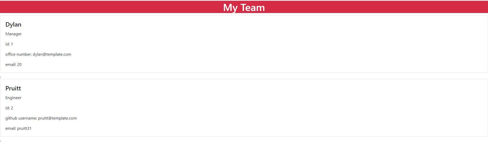
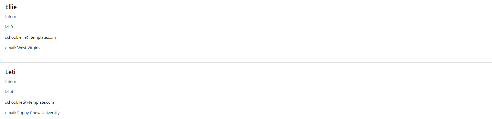

# Template-Engine

Created a Node CLI that takes in information about employees and generates an HTML webpage that displays summaries for each person. Code passes given tests to ensure correct functionalality.

# How to Use

Run the below command to initiate the program to create your team page.

# node app.js

User is prompted to fill out the team manager's information. After the manager's information is filled out, the user is prompted to add either an engineer or an intern to the team. Once, the user chooses which team member to add, the user will be prompted to fill out that team member's information. Once that has been filled in, the user will be prompted to see if the team needs more team members or not. If the team is not completed, the process will continue as above. If the team is complete, the team will be put into an HTML page in the output folder. The webpage will display the team with all of their informaiton.

# Screenshots

